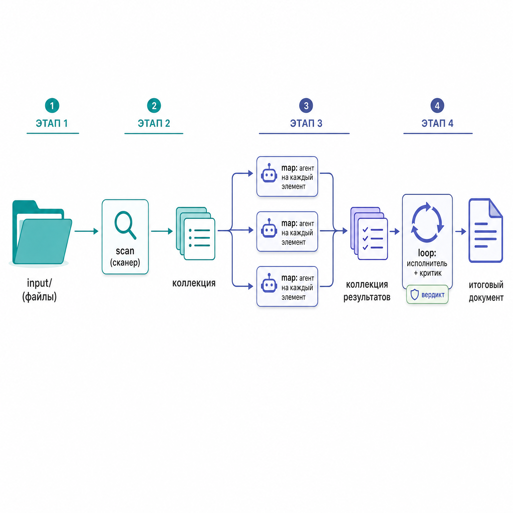
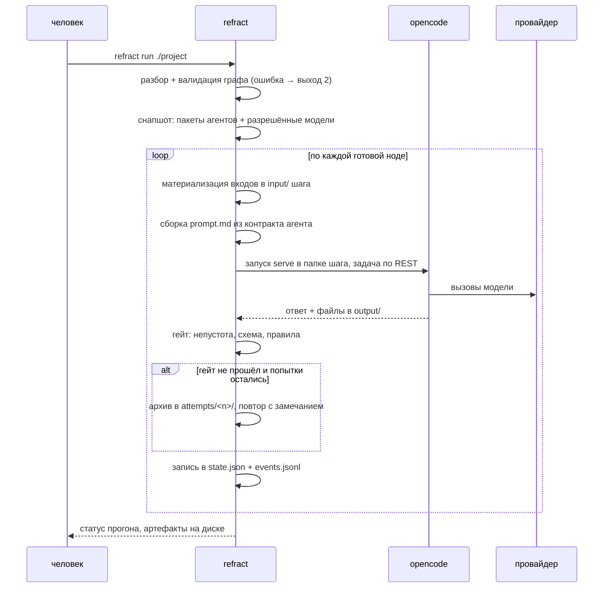

# refract

**Движок декларативных пайплайнов LLM-агентов с типизированными контрактами артефактов.**


Вы описываете конвейер работы в одном файле `pipeline.yaml`. Движок читает его, проверяет
целиком **до** первого обращения к модели, а затем исполняет: поднимает на каждый шаг
[opencode](https://opencode.ai) и общается с ним по локальному REST, подкладывает агенту
входные артефакты, забирает выходные и механически проверяет, что получилось то, что
обещано контрактом.


Проект написан под Windows в первую очередь (UTF-8 везде явно, `pathlib`, копирование
вместо симлинков там, где их нет), работает и на Linux/macOS.

---

## Содержание

- [Что это, в двух минутах](#что-это-в-двух-минутах)
- [Чем refract является](#чем-refract-является)
- [Чем refract не является](#чем-refract-не-является)
- [Сильные стороны](#сильные-стороны)
- [Чем отличается от Dify](#чем-отличается-от-dify)
- [Быстрый старт](#быстрый-старт)
- [Как это работает](#как-это-работает)
- [Язык пайплайна](#язык-пайплайна)
- [Типы артефактов](#типы-артефактов)
- [Пакет агента](#пакет-агента)
- [Гейт: механическая проверка результата](#гейт-механическая-проверка-результата)
- [Контейнеры: петля и выбор](#контейнеры-петля-и-выбор)
- [Человек в цикле](#человек-в-цикле)
- [Модели и провайдеры](#модели-и-провайдеры)
- [Что остаётся после прогона](#что-остаётся-после-прогона)
- [Инварианты](#инварианты)
- [Состояние проекта](#состояние-проекта)
- [Документация](#документация)

---

## Что это, в двух минутах

Типичная задача, ради которой движок написан: есть папка с документами (RFP, транскрипт
звонка, переписка) — нужно получить документ требований, а из него — проект решения, причём
так, чтобы результат можно было **защитить**: каждая цифра прослеживается до источника,
спорные места помечены как вопросы, а не замазаны.


На языке пайплайна это выглядит так:

```yaml
version: "0.1"
name: requirements_to_design
checkpoints: [refine]            # остановиться и дать человеку выверить требования

nodes:
  - id: scan                     # детерминированный обход папки, без LLM
    type: builtin/scanner

  - id: extract                  # по одному агенту на каждый документ, параллельно
    type: agent
    agent: source_processor@1
    map: scan.sources
    params: { workers: 3 }

  - id: refine                   # писатель и критик, раунды до одобрения
    type: loop
    params: { max_rounds: 3 }
    body:
      agent: requirements_writer@1
      inputs: { extracts: extract.extract }
    critic:
      agent: requirements_critic@1
      inputs: { draft: "@body", extracts: extract.extract }
    outputs: { doc: "@body" }

  - id: design                   # два кандидата на РАЗНЫХ моделях
    type: agent
    agent: solution_designer@1
    inputs: { requirements: refine.doc }
    map_over: { models: ["kimi/k3", "openai/gpt-5.6"] }

  - id: choose                   # выбрать сильнейший вариант
    type: select
    candidates: design.design_doc
    selector: { agent: solution_design_selector@1 }
```

Запуск:

```bash
uv run refract validate ./my-project      # проверить граф, не тратя ни одного токена
uv run refract run ./my-project           # прогнать; остановится на чекпоинте
uv run refract answer <run-dir> refine continue   # человек выверил — работаем дальше
```



Три вещи, которые здесь важнее синтаксиса:

1. **Критик получает не только черновик, но и источники** (`extracts: extract.extract`).
   Иначе он физически не может проверить, не выдумал ли писатель цифру, и вырождается в
   редактора стиля.
2. **Решение «ещё раунд или готово» движок берёт из типизированного JSON** (`verdict@v1`),
   а не из фразы в тексте ответа. Уговорить пайплайн словами нельзя.
3. **Форму документа проверяет гейт, а не модель.** Нет обязательного раздела — шаг
   возвращается на повтор с конкретным замечанием, и это не стоит ни одного вызова LLM.

---

## Чем refract является

- **Движком пайплайнов, где единицей обмена является артефакт-файл известного типа.**
  Не строка в переменной, а файл или каталог, у которого есть тип, JSON-схема и правила.
- **Инструментом инженера, живущим в git.** Пайплайн, агенты и типы — текстовые файлы;
  диффы, review, история — обычные.
- **Оркестратором чужих агентов.** Сам он моделей не вызывает: поднимает `opencode serve`
  на шаг и разговаривает с ним по локальному HTTP.
- **Локальным CLI + REST/WS API + веб-интерфейсом наблюдения.** Ни базы данных, ни
  Docker Compose: `uv sync` и вперёд.
- **Проверяемым до запуска.** Валидатор собирает все находки (22 ошибки + 2 предупреждения
  в закрытом перечне) и сообщает их списком, а не по одной.

## Чем refract не является

Здесь честно перечислено то, чего в проекте нет — чтобы не пришлось выяснять это по ходу.

- **Не платформа для чат-приложений.** Нет публикации приложения, нет диалогового
  интерфейса для конечного пользователя, нет встроенных API для чата.
- **Не RAG-платформа.** Нет векторных хранилищ, датасетов, индексации и ретриверов. Агент
  может дотянуться до внешнего поиска через MCP, но встроенного RAG в движке нет.
- **Не LLMOps-продукт.** Есть полный след прогона (`events.jsonl`, `raw.txt`,
  `agent.events.jsonl` на каждую попытку), но нет дашбордов, метрик качества, разметки
  ответов и A/B-инфраструктуры как продукта.
- **Не мультиарендная система.** Ни пользователей, ни ролей, ни организаций, ни облака.
  Проект — папка на диске.
- **Не визуальный редактор пайплайнов.** Веб-интерфейс показывает граф и прогон, а из
  правок умеет только модель ноды/элемента и число раундов петли. Пайплайны пишутся руками.
- **Не general-purpose workflow-движок.** Нет узлов «код», HTTP-запрос, условие и
  ветвление; нет триггеров, расписаний и вебхуков. Управляющие конструкции ровно две:
  петля и выбор (SPEC §16.2).
- **Не замена opencode.** opencode — обязательная зависимость исполнения.

Отдельно — известные ограничения текущей версии, которые не «архитектура», а просто ещё
не сделано: `cache: true` игнорируется (предупреждение `W_CACHE_UNSUPPORTED`), вопрос
человеку внутри петли или выбора не поддержан (честный `NotImplementedError`), вложенный
fan-out запрещён валидатором (`E_NESTED_MAP`).

---

## Сильные стороны

Каждое утверждение ниже соответствует тому, что реально исполняется кодом.

**Свобода выбора моделей — на уровне отдельного шага.**
Модель задаётся строкой `provider/model_id` и берётся из первого доступного источника:
override прогона → поле `model` ноды или элемента → дефолт проекта. Один пайплайн может
гонять дешёвую модель на извлечении и дорогую на дизайне, а провайдер — любой, какой
поддерживает opencode (OpenAI-совместимые описываются в `providers.yaml` через `npm` +
`base_url`).

**Конкурс моделей как штатная конструкция.**
`map_over: {models: [...]}` запускает один и тот же шаг на нескольких моделях, `select`
выбирает победителя типизированным `selection@v1`, а привязка `@choose.winner_model`
передаёт модель-победителя дальше по графу. Это не «попробуйте вручную» — это две строки в
YAML.

**Ошибки конфигурации ловятся до траты денег.**
Валидатор проверяет существование нод, портов, агентов и типов, совместимость рёбер,
полноту входов, ацикличность, разрешимость моделей и доступность провайдеров — и выдаёт
структурные находки `{code, node_id, message}`. Опечатка в имени порта не превращается в
шаг, который час думал без нужного файла.

**Качество формы проверяется механически, а не моделью.**
Гейт после каждого шага смотрит: файл/каталог существует, непуст, JSON проходит схему,
правила типа выполнены. Провал → `gate_report.json` → повтор с конкретным замечанием
(`gate_retries`, по умолчанию 2). Правило можно добавить в тип артефакта — и поведение
агентов изменится без правки промптов, потому что раздел про формат в промпте генерируется
из контракта.

**Управляющие решения нельзя подделать текстом.**
Продолжение петли, выбор победителя, остановка на вопрос — только из `verdict@v1`,
`selection@v1`, `question@v1`. Модель, написавшая «APPROVED» в свободном тексте, ничего не
переключит.

**Прогон воспроизводим и его можно догнать с середины.**
На старте создаётся снапшот: пакеты агентов и разрешённые модели фиксируются в папке
прогона. `resume` продолжает после падения (шаги в состоянии `running` при загрузке
леджера становятся `pending` — это и есть механизм восстановления), `rerun --from <node>`
пересчитывает узел и всё ниже, переиспользуя неизменившееся сверху, `--retry-failed`
повторяет упавшие шаги.

**Изоляция шага и минимизация секретов.**
Агент видит только свою рабочую папку (`input/`, `output/`) — путей проекта в промпте нет.
Ключи не попадают ни в артефакты, ни в промпты, ни в папку проекта: окружение прогона —
это ключи провайдеров из снапшота плюс MCP-токены только тех агентов, что реально
используются.

**Полный след для разбора.**
На каждый шаг агента сохраняются `prompt.md`, `raw.txt`, `agent.events.jsonl`, а
перезапуск не перетирает предыдущее: попытка уезжает в `attempts/<n>/`. Что именно
получил агент, чем ответил и почему шаг не прошёл — видно постфактум.

**Человек может вмешаться в середине и поправить файлы руками.**
`checkpoints: [node]` парковывает прогон после того, как выходы узла собраны. Артефакты —
обычные файлы: откройте, поправьте, затем `refract answer <run> <node> continue`.

**Проверяемость самого движка.**
493 python-теста (все на `MockRuntime`: без сети, без ключей, без opencode), 17 e2e-тестов
Playwright над собранным интерфейсом и настоящим движком, `mypy --strict` и `ruff` в
чистоте. Отдельный тест следит, чтобы спецификация языка не разъезжалась с кодом: каждый
код валидации описан, выдуманных кодов нет, а сводный пример из спеки прогоняется через
настоящий валидатор.

---

## Чем отличается от Dify

[Dify](https://dify.ai) — зрелая платформа для сборки AI-приложений: визуальный canvas,
чат-приложения, встроенный RAG, маркетплейс плагинов, мультиарендность. refract решает
другую задачу и в ряде мест сознательно уступает.

**Где refract лучше**

| Тема | refract | Dify |
|---|---|---|
| Единица обмена | артефакт-файл с типом, JSON-схемой и правилами; несовместимое ребро — ошибка валидации | переменные в графе; проверка соответствия в основном на этапе выполнения |
| Проверка до запуска | закрытый перечень из 24 кодов, все находки списком, exit-code для CI | линтеры DSL существуют как сторонние утилиты |
| Условие выхода из петли | типизированный артефакт `verdict@v1` от агента-критика | выражение над переменными (например, `quality_score > 0.9`) |
| Качество результата | механический гейт + автоматический повтор с замечанием | проверка описывается узлами графа вручную |
| Конкурс моделей | `map_over.models` + `select` + привязка `winner_model` — встроенная конструкция | собирается руками из параллельных ветвей |
| Где живёт истина | текстовые файлы в git; пайплайн, агенты и типы ревьюятся как код | приложение в базе платформы; YAML — экспорт/импорт |
| Артефакты | файлы и каталоги на диске, доступные любому инструменту | значения внутри платформы |
| Развёртывание | `uv sync`; ни БД, ни брокера, ни Docker | Docker Compose со сопутствующими сервисами |
| Кто исполняет агента | внешний CLI-агент (opencode) с доступом к файлам шага | исполнение внутри платформы |

**Где Dify лучше — и это не «зато»**

- Чат-приложения и публикация: веб-приложение, встраивание, API для конечного продукта.
- Встроенный RAG: датасеты, индексация, ретриверы.
- Богатый набор узлов: код, HTTP, условия и ветвления, классификаторы.
- Визуальный редактор, доступный не-инженеру.
- Плагины и маркетплейс, множество готовых интеграций.
- Мультиарендность, роли, облачная версия.
- Триггеры и расписания.
- Наблюдаемость и разметка как часть продукта.

**Паритет, а не преимущество.** Человек в цикле есть у обоих: в Dify это узел Human Input
(с формой, кнопками решений и таймаутом), в refract — чекпоинт с правкой файлов и
`question@v1` на обычной агентной ноде. У обоих это не работает **внутри** петли: у Dify
поддержка Human Input внутри Loop открыта как задача, у refract попытка задать вопрос из
петли даёт явный `NotImplementedError`.

**Когда брать refract:** документные конвейеры (набор источников → требования → проект
решения), где ценен прослеживаемый до источника результат в виде файлов; задачи, где нужно
сравнить несколько моделей на одной работе и выбрать лучшую; работа в инженерной среде,
где пайплайн должен лежать в репозитории и проходить review; сценарии с обязательной
выверкой человеком посередине.

**Когда брать Dify:** нужен чат-бот или веб-приложение для пользователей; нужен RAG «из
коробки»; пайплайн собирают не-инженеры; нужны ветвления, HTTP-вызовы и код внутри графа;
нужна многопользовательская платформа с ролями.

---

## Быстрый старт

```bash
uv sync                                   # зависимости
uv run refract templates                  # какие шаблоны есть
uv run refract init ./my-project --template extract --input ./docs
uv run refract validate ./my-project
uv run refract run ./my-project
uv run refract status ./my-project/runs/<run_id>
uv run refract serve                      # REST/WS API + веб-интерфейс
```

Конфигурация лежит в `~/.refract/`: `providers.yaml` (провайдеры, ключи — **только имена
переменных окружения**, лимиты параллелизма, каталоги моделей) и `mcp.yaml` (MCP-серверы).

```yaml
# ~/.refract/providers.yaml
providers:
  openai: { api_key_env: OPENAI_API_KEY, max_concurrent: 4, models: [gpt-5.6] }
  kimi:
    api_key_env: MOONSHOT_API_KEY
    max_concurrent: 4
    npm: "@ai-sdk/openai-compatible"      # любой OpenAI-совместимый провайдер
    base_url: "https://api.kimi.com/coding/v1"
    models: [k3, k3-256k]
library_path: /path/to/refract/library
```

Полный список команд: `validate`, `run`, `rerun`, `status`, `resume`, `answer`, `init`,
`templates`, `serve`, `catalog`, `agents`.

---

## Как это работает




**Нода и шаг — разные вещи.** Нода — вершина графа и единица переиспользования. Шаг —
конкретное исполнение: `map` по коллекции из пяти документов даёт пять шагов, петля из трёх
раундов — по шагу на элемент тела и критика в каждом раунде. У шагов свои идентификаторы
(`extract:rfp-md`, `refine.body:r2`) и свои папки.

**Порядок исполнения выводится, а не задаётся.** Движок строит зависимости из ссылок в
`inputs`, сортирует топологически и запускает всё, что готово, параллельно — с ограничением
по каждому провайдеру (`max_concurrent`) и по `workers` внутри fan-out.

**Один активный прогон на проект.** Он держит `.active.lock`; вторая попытка запустить или
возобновить тот же проект получает конфликт, а не гонку за один и тот же леджер. Правка
пайплайна во время прогона тоже отклоняется (SPEC §16.1) — иначе исполняемый граф
расходился бы с файлом на диске.

**Жизненный цикл шага один для всех.** Обычная агентная нода, элемент map, тело петли,
селектор — всё проходит одну и ту же последовательность: материализация входов → сборка
промпта → запуск → проверка вопроса человеку → гейт → запись в леджер.

---

## Язык пайплайна

Ниже — обзор. Нормативное определение со всеми правилами и кодами ошибок:
[SPEC-DSL.md](SPEC-DSL.md).

### Виды нод

| `type` | Что делает | Производит |
|---|---|---|
| `builtin/scanner` | детерминированный обход входной папки, без LLM | `sources: collection<source@v1>` |
| `builtin/brief` | берёт написанный бриф/тему из входной папки | `brief: brief@v1` |
| `agent` | один агент; с `map` — по элементу коллекции, с `map_over` — по модели | порты агента, либо коллекция при fan-out |
| `loop` | контейнер: тело (один агент или цепочка) + критик, раунды по вердикту | то, что объявлено в `outputs` |
| `select` | контейнер: селектор выбирает победителя из коллекции | порт `out` с типом элемента |
| `discover` | сетевой источник: агент ищет источники, коллекцию собирает движок | `sources: collection<source@v1>` |

### Ссылки: три формы и ничего больше

| Форма | Значение |
|---|---|
| `<nodeId>.<port>` | выходной порт **любой** ноды графа |
| `@body` / `@body.<port>` | выход тела петли (последнего элемента цепочки) |
| `@prev` / `@prev.<port>` | выход предыдущего элемента цепочки `body` |
| `@<selectId>.winner_model` | единственная скалярная привязка — модель победителя |

Важное следствие: ссылка адресует ноду **по идентификатору**, а не «предыдущую». Артефакт
можно взять у любой ноды на любом расстоянии вверх по графу, а несколько нужных
артефактов — это просто несколько записей в `inputs`.

```yaml
# критик дизайна судит черновик своей петли ПРОТИВ требований, которые
# произвела нода тремя слоями выше
critic:
  agent: solution_design_critic@1
  inputs:
    draft: "@body"
    requirements: refine.doc
```

### Fan-out

```yaml
# по документам: один шаг на элемент коллекции, до 3 параллельно
- id: extract
  type: agent
  agent: source_processor@1
  map: scan.sources
  params: { workers: 3, min_ok: 1, on_item_failure: skip }

# по моделям: один и тот же вход, два кандидата
- id: design
  type: agent
  agent: solution_designer@1
  inputs: { requirements: refine.doc }
  map_over: { models: ["kimi/k3", "openai/gpt-5.6"] }
```


Правила, которые проверит валидатор: `map` и `map_over` одновременно нельзя
(`E_MAP_CONFLICT`); источник `map` обязан быть коллекцией (`E_TYPE_MISMATCH`); коллекция,
произведённая fan-out-нодой, снова разворачиваться не может (`E_NESTED_MAP`); элемент
привязывается к единственному подходящему по типу порту `consumes`, иначе
`E_MAP_PORT_AMBIGUOUS`.

Упавший элемент по умолчанию пропускается, но попадает в выходную коллекцию со статусом
`failed` — статистика видна, а не потеряна. Если удачных меньше `min_ok`, нода падает.

---

## Типы артефактов

Тип — это имя вида `name@vN` плюс конструктор коллекции `collection<X>`. Определения лежат
в `library/types/artifact_types.yaml`.

```yaml
version: "0.1"
types:
  source@v1: { kind: any }
  extract@v1: { kind: file, format: json, schema: extract.schema.json }
  requirements@v1:
    kind: file
    format: markdown
    rules:
      - { rule: regex, pattern: "\\A#\\s*Requirements:" }   # заголовок с первой строки
      - { rule: regex, pattern: "FR-\\d+" }
  design_doc@v1:
    kind: file
    format: markdown
    rules:
      - { rule: min_length, value: 2000 }
      - { rule: regex, pattern: '^##\s*Assumptions to confirm', flags: "m" }
      - { rule: regex, pattern: '^#{2,3}[^\n]*[Rr]isk', flags: "m" }
```

- `kind`: `file` | `dir` | `any`; `format`: `json` | `markdown` | `text`.
- `schema` — JSON-схема (Draft 2020-12), проверяется гейтом.
- `rules` — механические проверки содержимого: `regex` (с флагами `m i s x a u`) и
  `min_length`.

Правила — не косметика: все три правила `design_doc@v1` добавлены по итогам живых прогонов.
Без `min_length` трёхстрочный «дизайн» проходил гейт. Раздел `## Assumptions to confirm`
понадобился, чтобы предложения архитектора нельзя было подать как установленный факт. А
раздела про риски не оказалось у **обоих** кандидатов сразу — и раунд петли ушёл на
замечание, которое проверяется без модели.

**Совместимость рёбер**

| Источник | Приёмник | Результат |
|---|---|---|
| `T` | `T` | ок |
| `T` | `U` | `E_TYPE_MISMATCH` |
| `collection<X>` | `collection<X>` | ок |
| `collection<X>` | `X` | ок, **только** через `map:` |
| `T` (не коллекция) | `collection<...>` | `E_TYPE_MISMATCH` |

Последняя строка — следствие принципа «агент никогда не производит коллекцию»: коллекции
собирает движок (`map`, `map_over`, `scanner`, `discover`). Агент, объявивший
`produces` с типом коллекции, получит `E_AGENT_PRODUCES_COLLECTION`.

**Управляющие типы** движок добавляет сам, переопределить их нельзя (`E_RESERVED_TYPE`):
`verdict@v1` (продолжать петлю или нет), `selection@v1` (кто победил), `question@v1`
(вопрос человеку), `answer@v1` (ответ человека).

---

## Пакет агента

Агент — это папка с контрактом и промптом. Ничего больше.

```
library/agents/requirements_critic/
├── agent.yaml     # контракт: что потребляет, что производит, что ему нужно
└── prompt.md      # только СУТЬ работы; про форматы писать не нужно
```

```yaml
name: requirements_critic
version: 1
description: >
  Судит черновик требований против исходных экстрактов и выдаёт verdict@v1.
consumes:
  - { port: draft, type: requirements@v1 }
  - { port: extracts, type: collection<extract@v1> }
produces:
  - { port: verdict, type: verdict@v1 }
needs: [read, edit]          # + "mcp:<server>" для внешних инструментов
defaults:
  timeout_s: 1800
```

**Разделы «что ты получаешь» и «куда писать» в промпт добавляет движок** — он генерирует их
из `agent.yaml`. Поэтому контракт и промпт не могут разойтись, а изменение типа артефакта
(например, новое правило) немедленно доезжает до агента без правки текста промпта.

`needs` — это возможности: `read`, `edit`, `vision`, `webfetch`, `bash` и `mcp:<server>`.
Каждой присвоен тир риска (`safe` < `moderate` < `dangerous`), и политика проекта может
требовать подтверждения человеком перед шагом, который их использует. MCP-сервер, которого
нет в `~/.refract/mcp.yaml`, — ошибка валидации `E_MCP_UNDECLARED`, а не сюрприз во время
прогона.

---

## Гейт: механическая проверка результата

После каждого шага агента движок проверяет **каждый обязательный выходной порт**:

1. файл или каталог существует;
2. он непуст (каталог — есть хотя бы один не-точечный элемент, файл — ненулевой размер);
3. если формат JSON — разбирается и проходит схему типа;
4. все `rules` типа выполнены.


Провал → `gate_report.json` рядом с шагом, попытка уезжает в `attempts/<n>/`, шаг
повторяется с добавкой `gate_feedback`, где написано, что именно не сошлось. Попыток —
`gate_retries + 1` (по умолчанию 3). Счётчики гейта и инфраструктурных повторов
независимы: провал формата и падение провайдера — разные события.

Транзиентная ошибка провайдера (`429`, `5xx`, `401` от лимитера) считается
инфраструктурной и повторяется с экспоненциальной паузой; исчерпанная квота и
`400`/`404` — терминальны, потому что пауза их не лечит.

---

## Контейнеры: петля и выбор

Контейнер — нода, внутри которой несколько элементов со своими агентами и моделями. В графе
это одна вершина.

Контейнером её делает не рамка в интерфейсе, а **контрольное решение, которое движок берёт
из типизированного артефакта**. Отсюда модель: контейнер = элементы + **один** контроллер +
один контрольный тип.

| Архетип | Контроллер | Контрольный тип | Решение движка |
|---|---|---|---|
| `loop` | `critic` | `verdict@v1` | ещё раунд или выход |
| `select` | `selector` | `selection@v1` | какой кандидат победил |

Множество архетипов закрыто: новый вид контроля добавляется новым архетипом, а не свободной
композицией. Контейнер с условием выхода, записанным в YAML, рассматривался и отклонён —
условие пришлось бы выражать языком выражений над артефактами, что ослабляет статическую
проверку и открывает обход принципа «управление только из типизированных артефактов».

Число элементов, наоборот, контролю не мешает — поэтому `body` может быть **цепочкой**:

```yaml
- id: refine
  type: loop
  params: { max_rounds: 3 }
  body:
    - agent: requirements_writer@1              # body1 — пишет
      inputs: { extracts: extract.extract }
    - agent: requirements_fact_checker@1        # body2 — сверяет с источниками
      inputs: { draft: "@prev", extracts: extract.extract }
  critic:                                       # контроллер один
    agent: requirements_critic@1
    inputs: { draft: "@body", extracts: extract.extract }
  outputs: { doc: "@body" }
```

Элементы идут по порядку внутри раунда, `@prev` несёт артефакт предыдущего, выход
**последнего** элемента и есть черновик раунда: его судит критик, из него собираются
`outputs`, из него берётся предыдущая версия для следующего раунда. Контекст ревизии
(предыдущий черновик + вердикт) достаётся только первому элементу — он переписывает.

Если критик так и не одобрил за `max_rounds`, поведение задаёт `on_max_rounds`: `pass`
(взять последнюю версию и предупредить) или `fail`.

`select` при единственном годном кандидате не тратит вызов на селектор, а при негодном
выборе поведение задаёт `fallback` (`first_ok` или `fail`).

---

## Человек в цикле

Два разных механизма, для двух разных ситуаций.

**Чекпоинт — «остановись, я проверю».** Объявляется на уровне пайплайна:

```yaml
checkpoints: [refine]
```

Прогон доходит до конца узла, **собирает его выходы** и парковывается в состоянии
`waiting_human`. Артефакты — обычные файлы: их можно прочитать и **поправить руками** (это
единственное санкционированное исключение из неизменяемости готовых шагов). Дальше:

```bash
refract answer <run-dir> refine continue   # работаем дальше с тем, что есть на диске
refract answer <run-dir> refine reject     # прогон отменён
```

Ту же остановку можно задать на один прогон, не меняя пайплайн: `run --stop-after <node>`.

**Вопрос от агента — «я не могу решить сам».** Агент объявляет необязательный выходной порт
типа `question@v1`; если он его записал, шаг переходит в `waiting_human` и ждёт ответа:

```bash
refract answer <run-dir> <step-id> "ERP — SAP S/4HANA, интеграция через SOAP"
```

Ответ становится артефактом `answer@v1`, и шаг повторяется уже с ним. Работает на обычных
агентных нодах; внутри петли или выбора — нет (`NotImplementedError`, а не тихий сбой).

**Подтверждение опасных возможностей.** Политика проекта может требовать явного «да» перед
шагом, который использует чувствительные возможности:

```yaml
# project.yaml
confirm: [webfetch]        # или confirm_tier: moderate
```

Такой шаг парковывается **до** запуска, и подтверждается тем же механизмом ответа:

```bash
refract answer <run-dir> <step-id> approve
```

---

## Модели и провайдеры

Модель — строка `provider/model_id`. Порядок разрешения: override прогона → `model` ноды
или элемента контейнера → `defaults.model` проекта. Если не нашлось —
`E_MODEL_UNRESOLVED`; если провайдер не настроен или его переменная окружения пуста —
`E_PROVIDER_UNAVAILABLE`. Оба сообщения приходят из валидатора, до прогона.

```yaml
- id: design
  type: agent
  agent: solution_designer@1
  inputs: { requirements: refine.doc }
  map_over: { models: ["kimi/k3", "openai/gpt-5.6"] }   # конкурс

- id: choose
  type: select
  candidates: design.design_doc
  selector: { agent: solution_design_selector@1 }

- id: sd_refine
  type: loop
  params: { model: "@choose.winner_model" }             # дальше — на модели победителя
  body:
    agent: solution_designer@1
    inputs: { requirements: refine.doc }
  critic:
    agent: solution_design_critic@1
    inputs: { draft: "@body", requirements: refine.doc }
  outputs: { design: "@body" }
```

Привязка `winner_model` законна только если кандидаты действительно пришли из
`map_over.models` — иначе «модель победителя» не определена, и это `E_BINDING_ILLEGAL`.

Параллелизм ограничен по каждому провайдеру (`max_concurrent` в `providers.yaml`), поэтому
конкурс моделей не превращается в шторм запросов к одному API.

---

## Что остаётся после прогона

```
runs/run_20260727_120915/
├── state.json                  # леджер: узлы и шаги (пишет только движок, атомарно)
├── events.jsonl                # поток событий, append-only, со сквозной нумерацией
├── snapshot/                   # пакеты агентов + разрешённые модели этого прогона
└── steps/
    ├── scan/main/output/
    ├── extract/rfp-excerpt-md/
    │   ├── prompt.md           # что именно получил агент
    │   ├── raw.txt             # что он ответил
    │   ├── agent.events.jsonl  # его инструментальные вызовы
    │   ├── input/              # материализованные входы (только они ему и видны)
    │   └── output/             # артефакты
    └── refine/
        ├── body_r1/  critic_r1/  body_r2/  ...
        │   └── attempts/1/     # предыдущая попытка, если был повтор
        └── _out/               # собранные выходы узла
```

Интерфейс и CLI рисуют состояние **только** из `state.json` и `events.jsonl` — отдельного
состояния исполнения не существует, поэтому «показанное» не может разойтись с
«произошедшим».

Веб-интерфейс (`refract serve`) показывает список проектов, галерею шаблонов, граф
пайплайна с контейнерами и элементами, живой прогон по WebSocket, парковку на чекпоинте с
ссылками на артефакты и инспектор для правки модели и числа раундов.

---

## Инварианты

Правила, которые в этом проекте считаются не «стилем», а условием корректности. Их
нарушение — баг, и на них настроены ревью-агенты.

| # | Инвариант |
|---|---|
| I1 | Агент видит только свою рабочую папку шага. Путей проекта в промпте нет |
| I2 | Папки завершённых шагов неизменяемы (исключение — правка человеком на чекпоинте) |
| I3 | `state.json` пишет только движок и только атомарно |
| I4 | Управляющие решения — только из типизированных артефактов, никогда из текста |
| I5 | Разделы про входы/выходы в промпте генерируются из `agent.yaml`, а не пишутся руками |
| I6 | Агенты не производят коллекции; fan-out живёт в движке |
| I7 | Интерфейс и CLI рисуют только `state.json` + `events.jsonl` |
| I8 | Секреты не попадают в папки проекта, артефакты и промпты; окружение минимально |
| I9 | Каждый шаг агента сохраняет `prompt.md`, `raw.txt`, `agent.events.jsonl` — на попытку |
| I10 | Функции будущих фаз не делаются раньше времени |

---

## Состояние проекта

Механика фаз 0–5 закрыта: движок, метаноды, API, человек в цикле, каталог и безопасная
запись пайплайна, сетевой источник коллекции, чекпоинты, веб-интерфейс. Проверки: 493
python-теста, 17 e2e, `mypy --strict`, `ruff`.

Живые прогоны на реальном opencode проходили для конвейеров `extract`, `discovery` и
`requirements_to_design` — они и вскрыли большую часть дефектов, которые сейчас закрыты
тестами и правилами типов. Не проверены на живых моделях: исследовательский конвейер
(`discover` + сеть), хвост финальной петли доработки дизайна и цепочка `body`. Подробности
и историю дефектов см. [PROGRESS.md](PROGRESS.md).

В библиотеке: 13 агентов, 5 шаблонов пайплайнов, 14 типов артефактов (10 библиотечных + 4
управляющих).

---

## Документация

| Документ | О чём |
|---|---|
| [SPEC.md](SPEC.md) | единственный источник истины по семантике движка: форматы, исполнение, леджер, гейты, рантайм |
| [SPEC-DSL.md](SPEC-DSL.md) | нормативное определение языка `pipeline.yaml`: синтаксис, поля, грамматика ссылок, типы, **все** коды валидации |
| [SPEC-UI.md](SPEC-UI.md) | спецификация веб-интерфейса |
| [docs/ARCHITECTURE.md](docs/ARCHITECTURE.md) | связный технический разбор поверх SPEC: принципы, исполнение, состояние, восстановление |
| [docs/opencode-smoke.md](docs/opencode-smoke.md) | ручная проверка адаптера на настоящем opencode |
| [PROGRESS.md](PROGRESS.md) | текущая фаза, история живых прогонов и найденных дефектов |
| [CLAUDE.md](CLAUDE.md) | правила работы с репозиторием для агентов-помощников |

Расхождение кода и SPEC.md — это баг: правится одно из двух, явно и в том же коммите.
