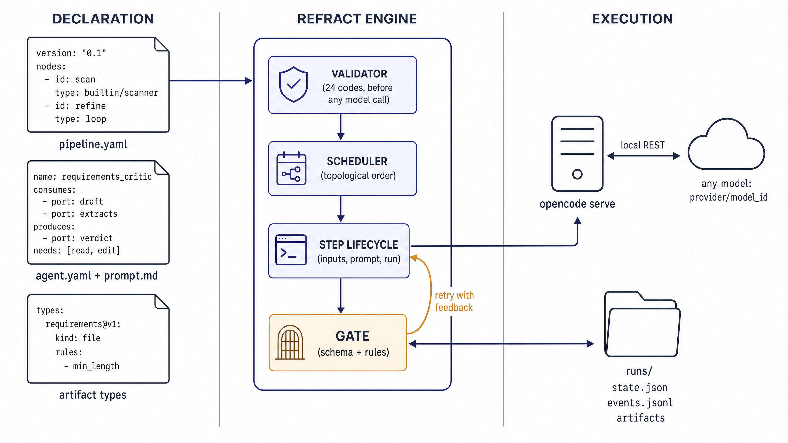
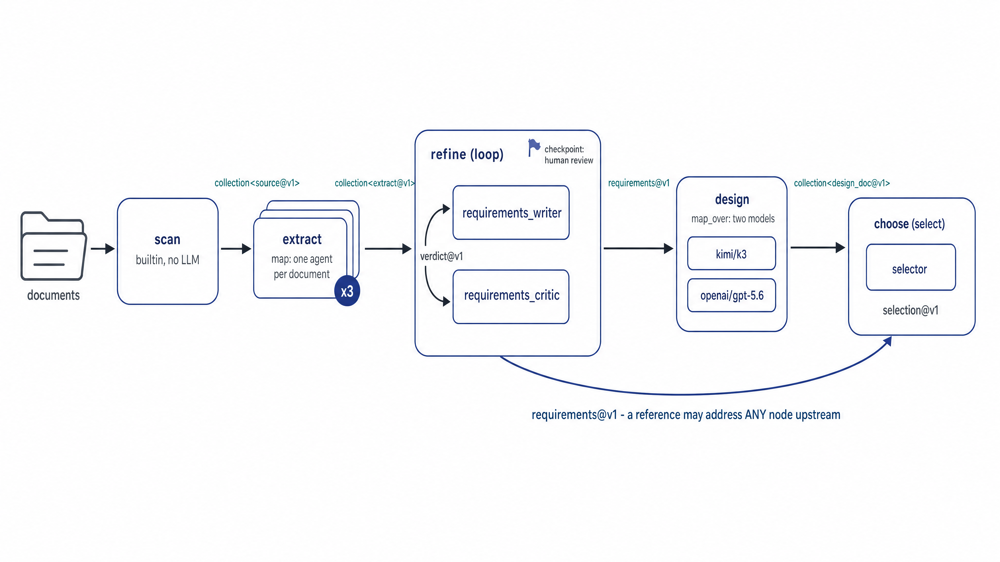
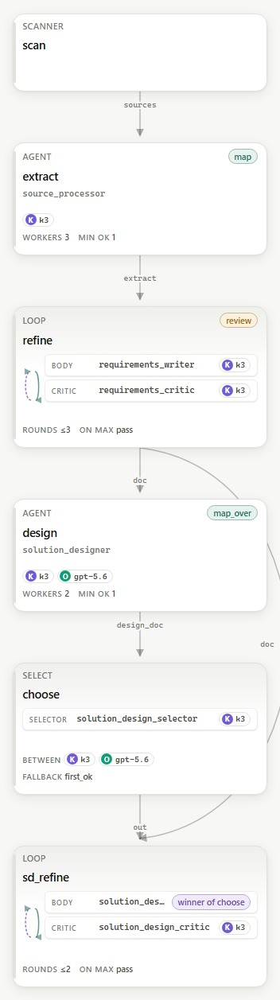
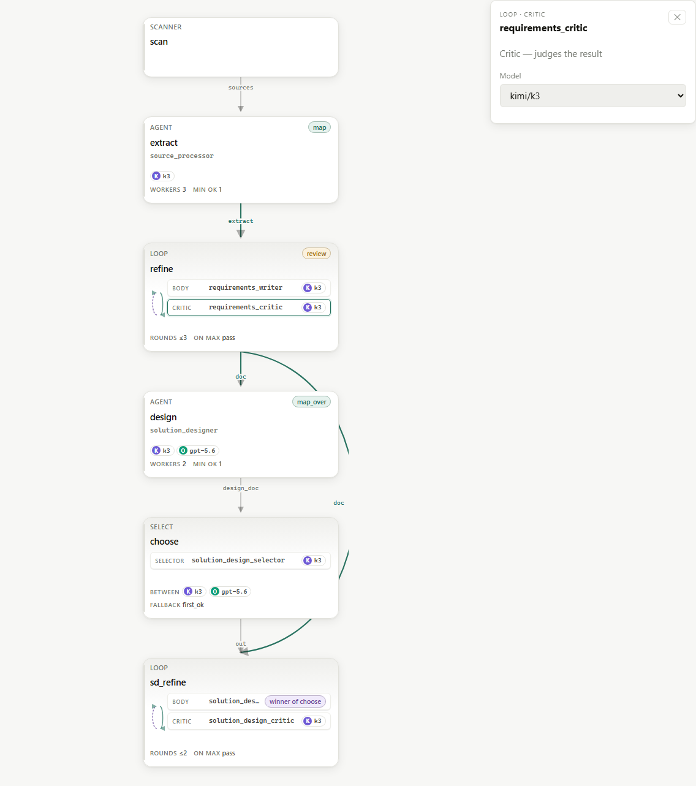
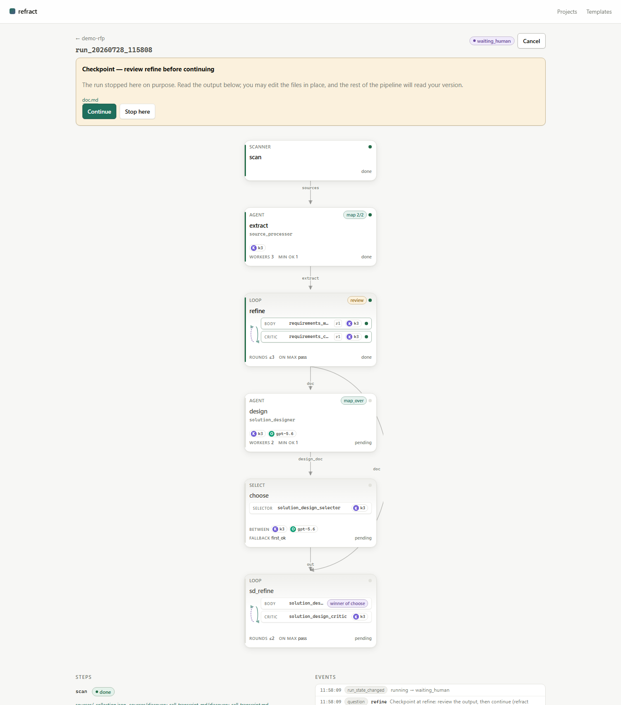
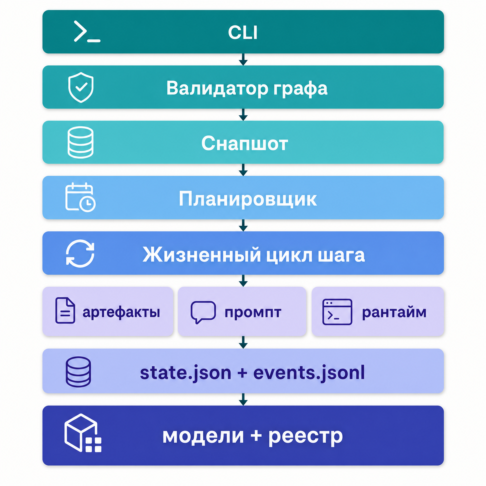
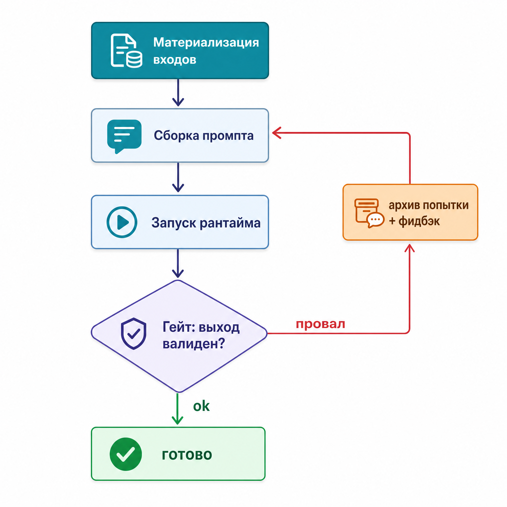

# Проект refract


## Содержание

- [Проект refract](#проект-refract)
  - [Цель проекта](#цель-проекта)
  - [Как это устроено](#как-это-устроено)
  - [Что это даёт](#что-это-даёт)
- [Чем refract является](#чем-refract-является)
- [Чем refract не является](#чем-refract-не-является)
- [Примеры конвейеров](#примеры-конвейеров)
- [Ключевые возможности, которых нет в Dify](#ключевые-возможности-которых-нет-в-dify)
- [Быстрый старт](#быстрый-старт)
- [Устройство исполнения](#устройство-исполнения)
- [Язык описания конвейера](#язык-описания-конвейера)
- [Типы артефактов](#типы-артефактов)
- [Агенты](#агенты)
- [Гейт: проверка результата шага](#гейт-проверка-результата-шага)
- [Контейнеры: петля и выбор](#контейнеры-петля-и-выбор)
- [Человек в цикле](#человек-в-цикле)
- [Модели и провайдеры](#модели-и-провайдеры)
- [Что остаётся после прогона](#что-остаётся-после-прогона)
- [Инварианты](#инварианты)
- [Состояние проекта](#состояние-проекта)
- [Документация](#документация)

---

## Проект refract

### Цель проекта

Подготовка качественных документов в задачах предпроектного и проектного анализа:
требования по запросу на предложение (RFP), технические дизайны, исследования и подобные.
Ключевое требование к результату — отсутствие выдумок: документ на тридцать страниц
обесценивается одной уверенно поставленной цифрой, которой нет ни в одном источнике, потому
что дальше читатель перестаёт доверять и остальным цифрам.

Языковая модель по своей природе выдаёт правдоподобное, а не проверенное, и в одиночном
запросе отличить одно от другого нечем: нет ни второго мнения, ни доступа к источнику в
момент проверки. Поэтому качество здесь достигается не подбором формулировок в запросе, а
устройством процесса — разделением ответственности между агентами и механическими проверками
между шагами.

Выверенный документ в этом проекте означает три конкретных свойства.

Прослеживаемость. Каждое утверждение возводится к источнику. Извлечение из документа —
отдельный шаг с типизированным результатом, где кроме самих фактов хранится, из какого
источника они взяты и какова оценка доверия к нему (высокая, средняя, низкая). Сводный
документ пишется только из этих извлечений, а не из общих знаний модели.

Явная фиксация расхождений. Когда источники противоречат друг другу — в одном 25 устройств,
в другом 40 — расхождение не проглатывается и не решается молча. Оно попадает в документ либо
как разрешённый конфликт с указанием основания («принята цифра из RFP как контрактная»), либо
как открытый вопрос к заказчику.

Отделение предложений от фактов. Это про то, что в проектных документах смешивают две разные
вещи: требование заказчика и решение автора. Фраза «сервис на Spring Boot 4.1» выглядит как
установленный факт, хотя это выбор архитектора, а конкретной версии может и не существовать.
Такие утверждения — версии, продукты, вендорские инструменты, предположения о среде
заказчика — обязаны быть помечены как предложения и собраны в закрывающем разделе допущений,
с указанием, чем каждое подтверждается. Наличие такого раздела проверяется механически, а
утверждения о том, что вендор планирует или рекомендует, критик считает блокирующим дефектом:
проверить их нельзя ни автору, ни читателю.

Как это обеспечивается по шагам:

- извлечение: по одному агенту на каждый источник, параллельно. Агент умеет читать PDF через
  подключённый внешний инструмент и распознавать сканы, поэтому источник не обязан быть
  текстовым;
- сведение: отдельный агент собирает из извлечений один документ, объединяет дубли и
  переносит открытые вопросы источников в документ, а не отбрасывает их;
- сверка: агент-фактчекер проходит по написанному против извлечений и возвращает исправленный
  документ — цифры без источника убираются или уходят в вопросы, потерянные обоснования
  возвращаются на место;
- критика: агент-критик выносит вердикт «одобрено» или «на доработку» со списком замечаний.
  Он получает не только черновик, но и сами источники — критик без источников способен судить
  только стиль. Пока вердикт отрицательный, документ переписывается с этими замечаниями, до
  заданного числа раундов;
- механические проверки: перед тем как результат шага будет принят, движок сам проверяет
  форму — есть ли обязательные разделы, достаточен ли объём, соответствует ли структура
  схеме. Это не стоит ни одного обращения к модели и не зависит от сговорчивости агента;
- конкуренция вариантов: один и тот же шаг можно поручить нескольким моделям и поставить
  отдельного агента-селектора, который сравнит результаты и выберет лучший с обоснованием;
- выверка человеком: в заданных точках конвейер останавливается, отдаёт человеку готовый
  документ и продолжает работу уже с тем, что человек проверил и, если нужно, поправил.

Отдельный режим — исследование, когда источников на входе нет вообще. Вместо папки с
документами подаётся вопрос или тема; агент-искатель ищет материалы в сети через подключённый
поисковый инструмент, скачивает найденное и складывает как обычные источники, а требование
«не меньше N источников» задаётся параметром шага. Дальше работает та же цепочка извлечения,
сведения, сверки и критики — исследование получает те же гарантии прослеживаемости, что и
работа по присланным документам.

Инструменты агентов объявляются в их интерфейсах и проверяются до запуска: если агент
рассчитывает на веб-поиск, чтение PDF или генерацию иллюстраций, а соответствующий внешний
сервер не объявлен в конфигурации, конвейер не запустится — вместо шага, который молча
отработал без нужного инструмента.

Типы документов, для которых конвейеры уже собраны:

- документ требований по запросу на предложение (RFP) и сопутствующим материалам:
  коммерческому предложению, транскриптам звонков, переписке. Расхождения между источниками
  фиксируются явно — как разрешённый конфликт с указанием основания либо как открытый вопрос;
- технический дизайн: проект решения по требованиям — подход, архитектура, технологические
  решения с обоснованием выбора, риски с мерами снижения, допущения к подтверждению.
  Допускается параллельная подготовка нескольких вариантов разными моделями с последующим
  отбором лучшего;
- исследование темы: на входе формулировка вопроса, а не набор документов; источники агент
  находит и загружает из сети самостоятельно, далее применяется та же цепочка сведения и
  проверки;
- перечень вопросов к архитектуре для установочной встречи: формулируется по требованиям,
  затем отбирается и упорядочивается до состояния, пригодного для обсуждения;
- оформление и публикация готового документа: генерация иллюстраций, размещение в
  корпоративной вики.

Сам движок к перечисленным задачам не привязан: его предметная область — шаги, файлы между
шагами и типы этих файлов. Прикладное назначение конвейера определяется описанием и набором
агентов, поэтому новая задача добавляется файлом описания и пакетом агента без изменений в
движке.

### Как это устроено

Конвейер описывается на отдельном языке — формате `pipeline.yaml` со строгой грамматикой и
полной проверкой. В описании задаётся: какие шаги есть, какой агент делает каждый, что он
получает на вход, что обязан отдать на выход, где остановиться и подождать человека.

Движок берёт это описание и исполняет:

1. разбирает и проверяет описание целиком — до первого обращения к модели;
2. фиксирует снимок: какие версии агентов и какие модели участвуют в этом прогоне;
3. выстраивает порядок шагов по зависимостям и запускает независимые шаги параллельно;
4. на каждый шаг поднимает [opencode](https://opencode.ai), разговаривает с ним по локальному
   REST, подкладывает в рабочую папку шага входные файлы и забирает выходные;
5. механически проверяет результат: файл на месте, непуст, соответствует схеме и правилам своего
   типа. Не сошлось — шаг повторяется с конкретным замечанием;
6. пишет состояние и журнал событий, по которым потом можно разобрать любой прогон.



Рис. 1. Три зоны: что вы объявляете, что делает движок, где выполняется работа. Обратная
стрелка от проверки результата к шагу — это повтор с замечанием, а не падение прогона.

### Что это даёт

Коротким списком; подробный разбор каждого пункта — в разделе
[Чем refract является](#чем-refract-является).

- Файлы вместо переменных. Шаги обмениваются файлами и каталогами на диске: их можно открыть,
  сравнить, поправить руками, положить в git, отдать любому инструменту.
- Типы и порты. У каждого артефакта есть тип со схемой и правилами, у каждого агента —
  именованные входы и выходы. Несовместимая связь между шагами — ошибка проверки, а не странный
  результат в середине прогона.
- Проверка до траты денег. Опечатки в именах, незакрытые входы, циклы, несуществующие модели и
  недоступные провайдеры находятся до первого вызова модели.
- Механический контроль качества. Форму результата проверяет движок, а не модель: обязательные
  разделы, минимальный объём, структура JSON. Провал — автоматический повтор с указанием, чего
  именно не хватило.
- Управление только из структурированных файлов. Продолжить петлю, выбрать победителя,
  остановиться и спросить человека — движок решает по типизированному файлу, а не по фразе в
  тексте, поэтому формулировками в ответе модели ход исполнения изменить нельзя.
- Независимость от провайдера и модели. Модель задаётся строкой на каждом шаге: любой
  провайдер, который поддерживает opencode, включая совместимые с OpenAI по базовому адресу.
  Разные модели на разных шагах — например, экономичная на извлечении и более сильная на
  проектировании — задаются одной строкой в описании.
- Конкурс моделей штатной конструкцией. Один и тот же шаг запускается на нескольких моделях,
  отдельный агент выбирает победителя, и дальше по графу можно передать именно его модель.
- Агенты — часть репозитория. Агент это папка с интерфейсом и промптом: версионируется,
  проходит ревью, переиспользуется между проектами. Промпт содержит только суть работы —
  разделы про форматы файлов движок генерирует из интерфейса, поэтому они не расходятся.
- Внешние инструменты у агента. В интерфейсе перечисляется, что ему нужно: чтение, запись,
  распознавание изображений, сеть, запуск команд, и внешние серверы по протоколу Model Context
  Protocol — веб-поиск, чтение PDF, генерация картинок, корпоративная вики. Незаявленный
  сервер — ошибка проверки, а не сюрприз в середине прогона.
- Человек в цикле, три способа. Остановка после указанного шага с правкой файлов на диске;
  вопрос от агента, когда он не может решить сам; подтверждение перед шагом, который ходит в
  сеть или запускает команды.
- Параллельность с ограничениями. Независимые шаги идут одновременно, обработка набора
  документов разворачивается по элементам, но одновременные обращения к одному провайдеру
  ограничены заданным лимитом.
- Возобновление и переиспользование. Прогон продолжается после падения с того места, где встал;
  можно пересчитать один шаг и всё, что ниже, переиспользуя неизменившееся сверху; можно
  повторить только упавшее.
- Полный след каждого шага. Собранный промпт, сырой ответ, журнал обращений к инструментам, а
  предыдущая попытка не перетирается, а уезжает в архив.
- Изоляция и минимум секретов. Агент видит только свою рабочую папку — путей проекта в промпте
  нет. Ключи не попадают в артефакты, промпты и папку проекта; в окружение шага идут только те
  токены, которые нужны используемым агентам.
- Интерфейс оператора без отдельной установки. Одна команда поднимает веб-интерфейс: список
  проектов, галерея готовых конвейеров, граф с контейнерами и моделями шагов, живой прогон,
  остановки на выверку со ссылками на созданные документы, ответы человека, смена модели шага.
- Наблюдение без отдельного состояния. Командная строка и веб-интерфейс рисуют картинку только
  из файла состояния и журнала событий, поэтому показанное не может разойтись с произошедшим.
- Локальность. Ни базы данных, ни брокера, ни контейнеров: `uv sync` и запуск.

---

## Чем refract является

То же самое, но подробно — с указанием, как именно это работает.

### Движок, а не платформа

refract исполняет описания конвейеров и не навязывает своего способа хранить результат. У него
нет ни базы данных, ни собственного формата: проект — папка на диске с описанием, входными
данными и прогонами, а всё, что движок производит, остаётся файлами.

Веб-интерфейс есть, и это интерфейс оператора, а не публикуемое приложение: он показывает
проекты и готовые конвейеры, рисует граф, ведёт живой прогон, останавливается на выверке со
ссылками на созданные документы, принимает ответы человека и позволяет сменить модель шага или
число раундов петли. Работает он поверх тех же файлов — состояния прогона и журнала событий, —
поэтому картинка в интерфейсе не может разойтись с тем, что произошло на диске, а всё то же
самое доступно из командной строки.

Моделей он тоже не вызывает: на каждый шаг поднимается opencode как отдельный процесс, общение
идёт по локальному REST. Такое разделение даёт две вещи: движку не нужно знать про особенности
провайдеров, а агент получает полноценную среду с инструментами и файлами.

### Типизированные контракты между шагами

Единица обмена — артефакт: файл или каталог, у которого есть тип. Тип задаёт форму (файл,
каталог или произвольное содержимое), формат (JSON, markdown, текст), схему для JSON и правила
для текста.

Агент объявляет именованные входы и выходы — порты. Связь в описании соединяет выходной порт
одного шага со входным портом другого, и совместимость типов проверяется до запуска. Отдельно
есть наборы: много артефактов одного типа плюс описание набора. Наборы создаёт только движок;
агент всегда производит один артефакт.

### Проверка описания до запуска

Проверяются существование шагов, портов, агентов, типов и объявленных внешних серверов;
совместимость связей; подключены ли все обязательные входы; отсутствие циклов; разрешимость
модели на каждом шаге и доступность провайдера. Все замечания выдаются списком с кодами, а не по
одному, и команда возвращает код выхода — годится для непрерывной интеграции.

### Механический контроль качества результата

После каждого шага движок проверяет каждый обязательный выход: существует, непуст, соответствует
схеме, удовлетворяет правилам типа. Правила простые и проверяемые без модели: обязательный
фрагмент по регулярному выражению и минимальная длина.

Провал не роняет прогон: рядом с шагом появляется отчёт с причиной, попытка уезжает в архив, а
шаг повторяется — в промпт добавляется замечание, чего именно не хватило. Отсюда полезное
свойство: добавив правило в тип артефакта, вы меняете поведение агентов без правки промптов.

### Управление только из структурированных файлов

Все решения, которые меняют ход исполнения, движок принимает по типизированным файлам: вердикт
критика решает, делать ли ещё раунд; выбор селектора определяет победителя; вопрос агента
останавливает шаг и ждёт человека. Свободный текст на управление не влияет — модель, написавшая
«одобрено» в ответе, ничего не переключит.

### Свобода моделей и конкурс моделей

Модель — строка `провайдер/модель`, и она задаётся на каждом шаге отдельно. Порядок разрешения:
переопределение прогона, затем поле в описании шага, затем значение по умолчанию для проекта.
Провайдеры описываются в конфиге: встроенным достаточно имени переменной окружения с ключом,
совместимым с OpenAI нужны npm-пакет и базовый адрес.

Конкурс встроен в язык: `map_over` запускает шаг на нескольких моделях, `select` выбирает
победителя, а привязка `winner_model` передаёт модель победителя дальше по графу — так следующий
шаг работает на той модели, которая уже показала себя лучше.

### Агенты как содержимое репозитория

Агент — папка с интерфейсом (`agent.yaml`) и промптом (`prompt.md`). Он версионируется,
ревьюится и переиспользуется между проектами. В промпте пишется только суть работы: разделы
«что ты получаешь» и «куда писать результат» движок генерирует из интерфейса, поэтому контракт и
промпт не могут разойтись.

В интерфейсе же перечисляется, какие инструменты агенту нужны: встроенные возможности opencode и
внешние серверы по протоколу Model Context Protocol. Из этого следуют две проверки:
незаявленный сервер — ошибка описания, а в окружение шага попадают только те токены, которые
нужны используемым агентам.

### Человек в цикле

Три механизма под три разные ситуации: остановка после указанного шага (человек читает и правит
файлы, потом даёт продолжить); вопрос от агента, когда он не может решить сам; и подтверждение
перед шагом, который использует чувствительные возможности. Все три работают и из командной
строки, и из веб-интерфейса.

### Воспроизводимость, возобновление, переиспользование

На старте прогона фиксируется снимок: пакеты агентов и разрешённые модели. Дальше прогон можно
продолжить после падения с того места, где он встал; пересчитать конкретный шаг и всё ниже него,
переиспользуя неизменившееся сверху; повторить только упавшие шаги. Состояние пишет только
движок и только атомарно, поэтому оборванный прогон не оставляет мусора, который нельзя
разобрать.

### Наблюдаемость и разбор

На каждый шаг сохраняются собранный промпт, сырой ответ и журнал обращений агента к
инструментам; повторная попытка не перетирает предыдущую. Состояние и журнал событий —
единственный источник для интерфейса и командной строки, отдельного состояния исполнения не
существует.

### Проверяемость самого движка

493 теста на подставном рантайме — без сети, без ключей, без opencode; 17 сквозных тестов
Playwright над собранным интерфейсом и настоящим движком; строгая проверка типов и линтер в
чистоте. Отдельный тест следит, чтобы спецификация языка не разъезжалась с кодом: каждый код
проверки описан, выдуманных кодов нет, а сводный пример из спецификации прогоняется через
настоящий валидатор.

---

## Чем refract не является

Не платформа для чат-приложений. Собственный веб-интерфейс есть, но он предназначен тому, кто
запускает конвейеры и следит за ними; опубликовать конвейер как приложение для внешнего
пользователя — с диалогом, встраиваемым виджетом или готовым API продукта — нельзя. Результат
работы здесь документ, а не разговор.

Не система поиска по вашим документам с подстановкой найденного в запрос. Нет векторных
хранилищ, наборов данных и индексации. Агент может дотянуться до внешнего поиска через
подключаемые инструменты, но собственного хранилища знаний движок не имеет.

Не система мониторинга и оценки качества моделей. След каждого прогона на диске есть, но
дашбордов, метрик и разметки ответов как продукта нет.

Не многопользовательская система: ни аккаунтов, ни ролей, ни облака. Проект — папка на диске,
права на неё — права файловой системы.

Пока не визуальный конструктор конвейеров: собрать конвейер мышью — перетащить шаг, провести
связь — нельзя, описания пишутся руками, как код. Ограничение временное, а не принципиальное:
граф и так строится из описания, поэтому обратное направление — правка графа с записью в тот же
файл — вопрос объёма работ.

При этом интерфейс не только для чтения. Прямо в нём меняются модель любого шага (и отдельного
элемента внутри контейнера — например, только критика) и число раундов петли. Такая правка
пишется в тот же файл описания, который лежит в репозитории, и только после полной проверки:
если изменение делает конвейер невалидным, оно не записывается, а возвращается со списком
замечаний.

Пока не движок бизнес-процессов: нет запуска по расписанию и по внешнему событию, нет шага
«выполнить произвольный код» и шага «сделать HTTP-запрос».

Не замена opencode: opencode — обязательная зависимость исполнения, движок его вызывает.

---

## Примеры конвейеров

Два примера показывают диапазон: они отличаются даже тем, что подаётся на вход — папка
документов в одном случае и написанный запрос в другом.

### Пример 1: на входе документы

Обработка материалов по запросу на предложение. На выходе документ требований, а из него —
проект решения, с остановкой на выверку требований человеком и конкурсом двух моделей на этапе
проектирования.



Рис. 2. Тот же конвейер как граф. На связях — типы артефактов; дуга снизу показывает, что шаг
может брать артефакт у любого шага выше, а не только у предыдущего.

```yaml
version: "0.1"
name: requirements_to_design
checkpoints: [refine]            # остановиться и дать человеку выверить требования

nodes:
  - id: scan                     # обход папки, без обращения к модели
    type: builtin/scanner

  - id: extract                  # по одному агенту на каждый документ, параллельно
    type: agent
    agent: source_processor@1
    map: scan.sources
    params: { workers: 3 }

  - id: refine                   # писатель и критик, раунды до одобрения
    type: loop
    params: { max_rounds: 3 }
    body:
      agent: requirements_writer@1
      inputs: { extracts: extract.extract }
    critic:
      agent: requirements_critic@1
      inputs: { draft: "@body", extracts: extract.extract }
    outputs: { doc: "@body" }

  - id: design                   # два кандидата на разных моделях
    type: agent
    agent: solution_designer@1
    inputs: { requirements: refine.doc }
    map_over: { models: ["kimi/k3", "openai/gpt-5.6"] }

  - id: choose                   # выбрать сильнейший вариант
    type: select
    candidates: design.design_doc
    selector: { agent: solution_design_selector@1 }
```

Веб-интерфейс строит картинку из этого же описания — рисовать граф отдельно не нужно:



Рис. 3. Тот же конвейер в интерфейсе. Петля и выбор нарисованы контейнерами с элементами
внутри, у каждого элемента виден свой значок модели, на связях — имена портов, а у шага
проектирования — обе участвующие модели.



Рис. 4. Щелчок по элементу открывает панель свойств: роль элемента и выбор модели. Правка
пишется в тот же файл описания, который лежит в репозитории.

### Пример 2: на входе запрос, документов нет

Исследовательский сценарий. На входе написанный вопрос или тема; источники агент находит сам:
ищет в сети, скачивает найденное и складывает в каталог, а движок превращает этот каталог в
набор источников. Дальше идёт та же цепочка сведения и проверки.

```yaml
version: "0.1"
name: research
input_mode: brief                # проект хранит текст запроса, а не документы

nodes:
  - id: brief
    type: builtin/brief          # берёт написанный запрос из папки проекта

  - id: find
    type: discover               # ищет источники в сети
    agent: source_finder@1
    inputs: { brief: brief.brief }
    params: { min_sources: 3 }   # меньше трёх найденных — шаг неуспешен

  - id: extract
    type: agent
    agent: source_processor@1
    map: find.sources            # дальше всё как в первом примере
    params: { workers: 3 }

  - id: refine
    type: loop
    params: { max_rounds: 3 }
    body:
      agent: requirements_writer@1
      inputs: { extracts: extract.extract }
    critic:
      agent: requirements_critic@1
      inputs: { draft: "@body", extracts: extract.extract }
    outputs: { doc: "@body" }
```

Оба конвейера запускаются одинаково:

```bash
uv run refract validate ./my-project      # проверить описание, не тратя ни одного токена
uv run refract run ./my-project           # прогнать
uv run refract status <run-dir>           # посмотреть, где остановились
uv run refract answer <run-dir> refine continue   # человек выверил — работаем дальше
```

Прогон с остановкой на выверку выглядит так:



Рис. 5. Прогон дошёл до указанного шага, собрал его результат и ждёт человека. Документ можно
открыть по ссылке и поправить на диске: дальше конвейер прочитает именно вашу версию.

Три вещи в этих примерах важнее синтаксиса.

Критик получает не только черновик, но и источники (`extracts: extract.extract`). Иначе он
физически не может проверить, не выдумал ли писатель цифру, и вырождается в редактора стиля.

Решение «ещё раунд или готово» движок берёт из структурированного файла с вердиктом, а не из
фразы в тексте ответа.

Форму документа проверяет движок, а не модель. Нет обязательного раздела — шаг возвращается на
повтор с конкретным замечанием, и это не стоит ни одного вызова модели.

---

## Ключевые возможности, которых нет в Dify

[Dify](https://dify.ai) — зрелая платформа для сборки приложений на базе моделей: визуальный
конструктор, чат-приложения, поиск по своим данным, магазин расширений, многопользовательский
режим. Задача у refract другая, и вот что он умеет, а Dify нет.

- Артефакт вместо переменной: шаги обмениваются типизированными файлами и каталогами на диске, а
  не значениями внутри платформы. Результат доступен любому инструменту и ложится в репозиторий.
- Типы артефактов со схемой и правилами и порты у агентов: несовместимая связь между шагами
  отвергается при проверке описания.
- Проверка всего описания до запуска: закрытый перечень кодов, все замечания списком, код выхода
  для непрерывной интеграции.
- Механический контроль результата шага с автоматическим повтором и замечанием, чего не
  хватило, — вместо ручной сборки проверок из шагов графа.
- Условие выхода из петли как решение агента-критика в типизированном файле, а не выражение над
  переменными.
- Конкурс моделей встроенной конструкцией: один шаг на нескольких моделях, выбор победителя
  отдельным агентом и передача его модели дальше по графу.
- Модель, выбираемая на каждом шаге, с любым провайдером, который поддерживает opencode, включая
  совместимые с OpenAI по базовому адресу.
- Агент как папка в репозитории: интерфейс и промпт версионируются и проходят ревью, а разделы
  про форматы файлов в промпте генерируются из интерфейса.
- Полный след шага на диске: собранный промпт, сырой ответ, журнал инструментов, архив
  предыдущих попыток.
- Возобновление прогона после падения и пересчёт «от шага и ниже» с переиспользованием
  неизменившегося.
- Изоляция шага: агент видит только свою рабочую папку, путей проекта в промпте нет.
- Отсутствие инфраструктуры: ни базы, ни брокера, ни контейнеров.

Человек в цикле есть у обоих: в Dify это шаг с формой и кнопками решений, в refract — остановка
конвейера с правкой файлов на диске и вопрос от агента.

Обратное тоже верно: чат-приложения и публикация, встроенный поиск по своим данным, шаги с кодом
и HTTP-запросами, ветвления по условию, визуальный конструктор для не-инженера, расширения и
маркетплейс, многопользовательский режим и запуск по расписанию — сильные стороны Dify, и
refract их не заменяет.

---

## Быстрый старт

```bash
uv sync                                   # зависимости
uv run refract templates                  # какие готовые конвейеры есть
uv run refract init ./my-project --template extract --input ./docs
uv run refract validate ./my-project
uv run refract run ./my-project
uv run refract status ./my-project/runs/<run_id>
uv run refract serve                      # API + веб-интерфейс
```

Конфигурация лежит в `~/.refract/`. В `providers.yaml` — провайдеры: имена переменных
окружения с ключами (сами ключи в файл не попадают), лимиты параллелизма и списки моделей. В
`mcp.yaml` — внешние инструменты, которые агенты могут использовать.

```yaml
# ~/.refract/providers.yaml
providers:
  openai: { api_key_env: OPENAI_API_KEY, max_concurrent: 4, models: [gpt-5.6] }
  kimi:
    api_key_env: MOONSHOT_API_KEY
    max_concurrent: 4
    npm: "@ai-sdk/openai-compatible"      # любой провайдер, совместимый с OpenAI
    base_url: "https://api.kimi.com/coding/v1"
    models: [k3, k3-256k]
library_path: /path/to/refract/library
```

Команды: `validate`, `run`, `rerun`, `status`, `resume`, `answer`, `init`, `templates`,
`serve`, `catalog`, `agents`.

---

## Устройство исполнения



Рис. 6. Слои движка. Каждый слой опирается только на нижние: планировщик не знает, как
устроен рантайм, а жизненный цикл шага одинаков для всех видов шагов.

Шаг описания и шаг исполнения — разные вещи. В описании вы задаёте узел графа: он же единица
переиспользования. При исполнении узел разворачивается в один или несколько шагов: обход
коллекции из пяти документов даёт пять шагов, петля из трёх раундов — по шагу на элемент тела
и критика в каждом раунде. У шагов свои идентификаторы (`extract:rfp-md`, `refine.body:r2`) и
свои папки.

Порядок исполнения выводится, а не задаётся. Движок строит зависимости из ссылок во входах,
сортирует граф и запускает всё, что готово, параллельно — с ограничением по каждому
провайдеру и по числу рабочих внутри одного узла.

Жизненный цикл шага один для всех: обычный шаг с агентом, элемент обхода коллекции, тело
петли, селектор — всё проходит одну последовательность: подготовка входов, сборка промпта,
запуск, проверка результата, запись в журнал.

Один активный прогон на проект. Он держит признак занятости; вторая попытка запустить или
возобновить тот же проект получает конфликт, а не гонку за одно и то же состояние. Правка
описания во время прогона тоже отклоняется — иначе исполняемый граф расходился бы с файлом.

---

## Язык описания конвейера

Ниже обзор. Нормативное определение со всеми правилами и кодами ошибок:
[SPEC-DSL.md](SPEC-DSL.md).

### Виды узлов

| `type` | Что делает | Что отдаёт |
|---|---|---|
| `builtin/scanner` | обходит папку проекта: даёт каждому документу устойчивое короткое имя и считает хэш содержимого; без обращения к модели | коллекцию источников |
| `builtin/brief` | берёт написанный запрос (тему) из папки проекта | текст запроса |
| `agent` | запускает одного агента; с `map` — по элементу коллекции, с `map_over` — по модели | выходы агента, либо коллекцию при размножении |
| `loop` | контейнер: тело (один агент или цепочка) и критик, раунды до одобрения | то, что объявлено в `outputs` |
| `select` | контейнер: селектор выбирает победителя из коллекции кандидатов | одного победителя |
| `discover` | агент ищет источники в сети, коллекцию из находок собирает движок | коллекцию источников |

### Ссылки

Вход узла указывает, откуда взять артефакт. Форм всего четыре:

| Форма | Значение |
|---|---|
| `<узел>.<порт>` | выходной порт любого узла графа |
| `@body` | выход тела петли (последнего элемента цепочки) |
| `@prev` | выход предыдущего элемента цепочки внутри тела петли |
| `@<узел>.winner_model` | модель, чей вариант победил в выборе |

Важное следствие: ссылка адресует узел по имени, а не «предыдущий». Артефакт можно взять у
любого узла на любом расстоянии вверх по графу, а несколько нужных артефактов — это просто
несколько строк во входах.

```yaml
# критик проекта решения судит черновик своей петли против требований,
# которые произвёл узел тремя слоями выше
critic:
  agent: solution_design_critic@1
  inputs:
    draft: "@body"
    requirements: refine.doc
```

### Размножение шага

Два способа развернуть один узел описания в несколько шагов исполнения.

```yaml
# по документам: один шаг на элемент коллекции, до трёх одновременно
- id: extract
  type: agent
  agent: source_processor@1
  map: scan.sources
  params: { workers: 3, min_ok: 1, on_item_failure: skip }

# по моделям: один и тот же вход, два кандидата
- id: design
  type: agent
  agent: solution_designer@1
  inputs: { requirements: refine.doc }
  map_over: { models: ["kimi/k3", "openai/gpt-5.6"] }
```

Оба способа сразу указать нельзя. Источник для `map` обязан быть коллекцией. Элемент
коллекции подставляется в тот вход агента, тип которого совпадает с типом элемента — если
подходящих входов не ровно один, это ошибка описания.

Упавший элемент по умолчанию пропускается, но попадает в выходную коллекцию с пометкой о
неудаче — статистика видна, а не потеряна. Если удачных меньше `min_ok`, узел считается
неуспешным.

---

## Типы артефактов

Артефакт — это файл или каталог, которым один шаг делится со следующим. У каждого артефакта
есть тип: имя с версией, например `requirements@v1`. Версия в имени нужна, чтобы менять
формат, не ломая существующие конвейеры.

Тип задаёт три вещи:

- форма: `file` (один файл), `dir` (каталог с файлами) или `any` (что угодно — годится для
  входных документов неизвестного формата);
- формат содержимого: `json`, `markdown` или `text`;
- проверки: схема (для JSON) и правила (для текста).

Отдельно есть конструктор набора: `collection<X>` означает «много артефактов типа X плюс
описание набора». Наборы создаёт только движок — при обходе папки, при размножении шага по
элементам или моделям, при сборе найденных в сети источников. Агент всегда производит один
артефакт и никогда набор: так закреплено, что размножение — дело движка.

Типы объявляются в `library/types/artifact_types.yaml`:

```yaml
version: "0.1"
types:
  source@v1: { kind: any }
  extract@v1: { kind: file, format: json, schema: extract.schema.json }
  requirements@v1:
    kind: file
    format: markdown
    rules:
      - { rule: regex, pattern: "\\A#\\s*Requirements:" }   # заголовок с первой строки
      - { rule: regex, pattern: "FR-\\d+" }                 # есть нумерованные требования
```

### Что уже есть в библиотеке

Рабочие типы — то, чем обмениваются агенты:

| Тип | Форма | Что это |
|---|---|---|
| `source@v1` | что угодно | исходный документ: файл из папки проекта или скачанная страница |
| `brief@v1` | markdown | написанный запрос или тема — вход конвейера, у которого нет документов |
| `found_sources@v1` | каталог | что агент нашёл в сети: по файлу на источник; движок превращает это в коллекцию источников |
| `extract@v1` | json | структурированная выжимка из одного документа: требования, решения, ограничения, открытые вопросы, оценка доверия к источнику |
| `requirements@v1` | markdown | сводный документ требований по всем источникам |
| `design_doc@v1` | markdown | проект решения: подход, архитектура, технологические решения с обоснованием, риски, допущения к подтверждению |
| `arch_report@v1` | markdown | список вопросов к архитектуре, подготовленный для обсуждения |
| `discovery_report@v1` | markdown | отобранный и упорядоченный набор вопросов для установочной встречи |
| `illustration@v1` | каталог | сгенерированные иллюстрации к документу плюс описание, как их пересобрать |
| `publication@v1` | json | подтверждение публикации: адрес и идентификатор страницы, номер версии, число загруженных вложений |

Управляющие типы — то, чем агент сообщает движку решение. Их добавляет сам движок, и
переопределить их нельзя:

| Тип | Что означает |
|---|---|
| `verdict@v1` | вердикт критика: одобрено или нужна доработка, со списком замечаний. По нему петля решает, делать ли ещё раунд |
| `selection@v1` | выбор победителя из набора кандидатов с обоснованием |
| `question@v1` | вопрос человеку: агент не может решить сам и останавливает шаг |
| `answer@v1` | ответ человека, который движок подкладывает агенту при повторе шага |

### Правила

Правила — механические проверки содержимого, которые выполняет движок, а не модель. Их два
вида: `regex` (в тексте должен найтись такой фрагмент) и `min_length` (минимальная длина).

```yaml
design_doc@v1:
  kind: file
  format: markdown
  rules:
    - { rule: min_length, value: 2000 }
    - { rule: regex, pattern: '^##\s*Assumptions to confirm', flags: "m" }
    - { rule: regex, pattern: '^#{2,3}[^\n]*[Rr]isk', flags: "m" }
```

Все три правила добавлены по итогам живых прогонов. Без ограничения длины трёхстрочный
«проект решения» проходил проверку. Раздел с допущениями понадобился, чтобы предложения
архитектора нельзя было подать как установленный факт. А раздела про риски не оказалось у
обоих кандидатов сразу — и раунд петли ушёл на замечание, которое проверяется без модели.

### Совместимость связей

| Источник | Приёмник | Результат |
|---|---|---|
| тип `T` | тип `T` | связь допустима |
| тип `T` | другой тип | ошибка несовместимости |
| набор из `T` | набор из `T` | связь допустима |
| набор из `T` | одиночный `T` | только через размножение шага по элементам |
| одиночный `T` | набор | ошибка: наборы собирает движок, а не агент |

---

## Агенты

Агент — это единица работы, которую исполняет модель. В библиотеке он лежит папкой:

```
library/agents/requirements_critic/
├── agent.yaml          # интерфейс: что получает, что отдаёт, какие инструменты нужны
├── prompt.md           # суть работы; про форматы файлов писать не нужно
└── revision_hint.md    # необязательно: что учесть при повторе после замечаний
```

### Интерфейс агента

Интерфейс — это входы, выходы и требуемые инструменты. Он объявляется в `agent.yaml` и
является контрактом: по нему движок подкладывает файлы, генерирует разделы промпта про
форматы и проверяет результат.

```yaml
name: requirements_critic
version: 1
description: >
  Судит черновик требований против исходных выжимок и выдаёт вердикт.
consumes:                                              # входы
  - { port: draft, type: requirements@v1 }
  - { port: extracts, type: collection<extract@v1> }
produces:                                              # выходы
  - { port: verdict, type: verdict@v1 }
needs: [read, edit]                                    # инструменты
defaults:
  timeout_s: 1800                                      # предел на один шаг
```

Правила интерфейса, которые проверяются до запуска:

- вход можно объявить необязательным (`optional: true`) — тогда его разрешено не подключать.
  Так, у проектировщика решения вход с предыдущим черновиком необязателен: в первом раунде
  черновика ещё нет;
- основной выход должен быть ровно один. Он определяет, что получит следующий шаг и что
  попадёт в коллекцию при размножении;
- необязательный выход разрешён только один и только с вопросом человеку;
- выход не может быть набором: наборы собирает движок.

Имя порта — одновременно имя папки, куда движок положит файл. Агент из примера увидит в своей
рабочей папке `input/draft/draft.md` и `input/extracts/` с выжимками, а записать обязан
`output/verdict.json`. Путей проекта он не видит.

### Инструменты агента

`needs` перечисляет то, без чего агент не сделает работу. Инструменты бывают двух родов.

Встроенные возможности opencode:

| Возможность | Что даёт | Уровень риска |
|---|---|---|
| `read` | чтение файлов рабочей папки | безопасный |
| `vision` | распознавание изображений и сканов | безопасный |
| `edit` | запись файлов в рабочую папку | средний |
| `webfetch` | скачивание страниц по адресу | средний |
| `bash` | запуск команд оболочки | высокий |

Внешние инструменты, подключаемые по протоколу Model Context Protocol (MCP) — это способ дать
модели доступ к чужому сервису через единый интерфейс: веб-поиск, чтение PDF, генерация
картинок, корпоративная вики. Записываются как `mcp:<сервер>`, а сами серверы объявляются в
`~/.refract/mcp.yaml`:

```yaml
# ~/.refract/mcp.yaml
servers:
  # сервер, который запускается локально командой
  pdf-reader:    { command: ["npx", "-y", "@mcp/pdf-reader"], env: {} }
  # удалённый сервер: адрес и переменная окружения с токеном
  tavily-remote: { url: "https://mcp.tavily.com/mcp/", token_env: TAVILY_API_KEY }
```

```yaml
# в агенте
needs: [read, edit, vision, "mcp:pdf-reader"]
```

Что здесь важно:

- сервер, которого нет в конфиге, — ошибка проверки описания, а не сюрприз во время прогона:
  шаг не запустится с инструментом, которого у него не будет;
- в окружение шага попадают токены только тех серверов, которые нужны используемым агентам, и
  ничего больше;
- у каждой возможности есть уровень риска, и политика проекта может требовать подтверждения
  человеком перед шагом, который использует чувствительные возможности;
- узел, до которого доходят непроверенные документы и который при этом умеет запускать
  команды или ходить в сеть, помечается предупреждением при проверке описания — это путь
  «чужой документ управляет инструментом».

### Промпт агента и что дописывает движок

В `prompt.md` пишется только суть работы: что оценивать, на что смотреть, что считать
дефектом. Разделы «что ты получаешь» и «куда писать результат» движок генерирует из
интерфейса и добавляет сам. Поэтому контракт и промпт не могут разойтись, а новое правило в
типе артефакта немедленно доезжает до агента без правки текста промпта.

Если шаг повторяется после замечаний критика, движок дополнительно подкладывает предыдущую
версию документа и вердикт, а также подсказку из `revision_hint.md`, если она есть.

### Роли агентов

Движок не знает про роли — он знает только про типы. Роль здесь просто способ читать
библиотеку: чем агент отличается от соседа по интерфейсу.

| Роль | Что делает | Интерфейс | В библиотеке |
|---|---|---|---|
| Поиск источников | по запросу ищет и скачивает материалы | запрос → каталог находок | `source_finder@1` |
| Обработка документа | вытаскивает из одного документа структурированную выжимку | документ → выжимка | `source_processor@1` |
| Сведение | собирает из множества выжимок один документ | набор выжимок → документ | `requirements_writer@1` |
| Проектирование | по требованиям делает проект решения | требования (+ прошлый черновик) → проект | `solution_designer@1` |
| Правка | исправляет документ против источников и отдаёт документ того же типа | документ + источники → документ | `requirements_fact_checker@1` |
| Критик | судит документ и выдаёт вердикт; управляет петлёй | документ + источники → вердикт | `requirements_critic@1`, `solution_design_critic@1` |
| Селектор | выбирает лучший вариант из кандидатов | набор кандидатов → выбор | `solution_design_selector@1` |
| Исследование | формулирует вопросы к архитектуре по требованиям | требования → список вопросов | `arch_probe@1` |
| Отбор | приводит список вопросов в пригодный для встречи вид | черновик + требования → отчёт | `arch_critic@1` |
| Оформление | делает иллюстрации к документу | проект решения → каталог иллюстраций | `illustrator@1` |
| Публикация | выкладывает документ во внешнюю систему | проект решения → подтверждение | `confluence_publisher@1` |

Критик и селектор — особые: их выход читает сам движок и принимает по нему решение. Все
остальные просто производят артефакты.

Добавить своего агента — значит положить папку с этими файлами и сослаться на него по имени с
версией. `refract agents list` покажет, что уже есть, а `refract catalog` — из чего вообще
можно собирать конвейер.

---

## Гейт: проверка результата шага



Рис. 7. Жизненный цикл шага. Проверка результата — не финальная приёмка, а точка, из
которой шаг может уйти на повтор с замечанием.

После каждого шага движок проверяет каждый обязательный выход:

1. файл или каталог существует;
2. он непуст (в каталоге есть хотя бы один файл, у файла ненулевой размер);
3. если формат JSON — содержимое разбирается и соответствует схеме;
4. все правила типа выполнены.

Провал не считается ошибкой прогона. Рядом с шагом появляется отчёт с причиной, попытка
уезжает в архив, а шаг повторяется — в промпт добавляется замечание, чего именно не хватило.
Число попыток задаётся параметром `gate_retries` (по умолчанию две дополнительные).

Отдельно считаются повторы из-за инфраструктуры: сбой соединения или временная ошибка
провайдера (слишком много запросов, ошибка на стороне сервиса) повторяется с растущей паузой.
Исчерпанная квота и неверный запрос повторов не получают — пауза их не лечит.

---

## Контейнеры: петля и выбор

Контейнер — узел, внутри которого несколько элементов со своими агентами и моделями. В графе
это одна вершина.

Контейнером его делает не рамка в интерфейсе, а решение, которое движок принимает по
структурированному файлу от одного из элементов. Отсюда устройство: элементы, ровно один
управляющий элемент и один тип управляющего артефакта.

| Контейнер | Управляющий элемент | Управляющий артефакт | Решение движка |
|---|---|---|---|
| `loop` | `critic` | вердикт | ещё раунд или выход |
| `select` | `selector` | выбор | какой кандидат победил |

Набор контейнеров закрыт: новый вид управления добавляется новым видом контейнера, а не
свободной сборкой. Контейнер с условием выхода, записанным в описании, рассматривался и
отклонён: условие пришлось бы выражать языком выражений над артефактами, что ослабляет
проверку до запуска и открывает обход правила «управление только из структурированных файлов».

Число элементов управлению не мешает — поэтому тело петли может быть цепочкой:

```yaml
- id: refine
  type: loop
  params: { max_rounds: 3 }
  body:
    - agent: requirements_writer@1              # пишет
      inputs: { extracts: extract.extract }
    - agent: requirements_fact_checker@1        # сверяет с источниками
      inputs: { draft: "@prev", extracts: extract.extract }
  critic:                                       # управляющий элемент один
    agent: requirements_critic@1
    inputs: { draft: "@body", extracts: extract.extract }
  outputs: { doc: "@body" }
```

Элементы идут по порядку внутри раунда, `@prev` несёт результат предыдущего, а результат
последнего элемента и есть черновик раунда: его судит критик, из него собираются выходы узла,
из него берётся предыдущая версия для следующего раунда. Контекст доработки достаётся только
первому элементу — он переписывает.

Если критик так и не одобрил за отведённые раунды, поведение задаёт `on_max_rounds`: взять
последнюю версию и предупредить, либо считать узел неуспешным.

Выбор при единственном годном кандидате не тратит вызов на селектор, а при негодном выборе
поведение задаёт `fallback`: взять первого годного или считать узел неуспешным.

---

## Человек в цикле

Три ситуации, три механизма.

Остановка на выверку — «дойди до этого места и подожди меня». Перечисляется в описании
конвейера:

```yaml
checkpoints: [refine]
```

Прогон доходит до конца узла, собирает его выходы и останавливается. Артефакты — обычные
файлы: их можно прочитать и поправить руками. Дальше:

```bash
refract answer <run-dir> refine continue   # работаем дальше с тем, что лежит на диске
refract answer <run-dir> refine reject     # прогон отменён
```

Ту же остановку можно задать на один прогон, не меняя описание: `run --stop-after <узел>`.

Вопрос от агента — «я не могу решить сам». Агент объявляет необязательный выход с вопросом;
если он его записал, шаг останавливается и ждёт ответа:

```bash
refract answer <run-dir> <step-id> "Учётная система — SAP S/4HANA, интеграция через SOAP"
```

Ответ становится артефактом и подкладывается агенту при повторе шага.

Подтверждение чувствительных возможностей — «спроси, прежде чем это делать». Политика проекта
может требовать явного согласия перед шагом, который ходит в сеть или запускает команды:

```yaml
# project.yaml
confirm: [webfetch]        # либо confirm_tier: moderate — по уровню риска
```

Такой шаг останавливается до запуска и подтверждается так же:

```bash
refract answer <run-dir> <step-id> approve
```

---

## Модели и провайдеры

Модель — строка `провайдер/модель`. Порядок разрешения: переопределение прогона, затем поле
`model` узла или элемента контейнера, затем значение по умолчанию для проекта. Если не
нашлось ничего — ошибка проверки. Если провайдер не настроен или его переменная окружения
пуста — тоже ошибка, и обе приходят до прогона, а не в середине.

```yaml
- id: design
  type: agent
  agent: solution_designer@1
  inputs: { requirements: refine.doc }
  map_over: { models: ["kimi/k3", "openai/gpt-5.6"] }   # конкурс

- id: choose
  type: select
  candidates: design.design_doc
  selector: { agent: solution_design_selector@1 }

- id: sd_refine
  type: loop
  params: { model: "@choose.winner_model" }             # дальше — на модели победителя
  body:
    agent: solution_designer@1
    inputs: { requirements: refine.doc }
  critic:
    agent: solution_design_critic@1
    inputs: { draft: "@body", requirements: refine.doc }
  outputs: { design: "@body" }
```

Привязка к модели победителя законна только если кандидаты действительно пришли от конкурса
моделей — иначе «модель победителя» не определена, и это ошибка описания.

Параллелизм ограничен по каждому провайдеру, поэтому конкурс моделей не превращается в шторм
запросов к одному сервису.

---

## Что остаётся после прогона

```
runs/run_20260727_120915/
├── state.json                  # состояние: узлы и шаги; пишет только движок, атомарно
├── events.jsonl                # поток событий, только дописывается, со сквозной нумерацией
├── snapshot/                   # пакеты агентов и разрешённые модели этого прогона
└── steps/
    ├── scan/main/output/
    ├── extract/rfp-excerpt-md/
    │   ├── prompt.md           # что именно получил агент
    │   ├── raw.txt             # что он ответил
    │   ├── agent.events.jsonl  # его обращения к инструментам
    │   ├── input/              # подготовленные входы — только их он и видит
    │   └── output/             # артефакты
    └── refine/
        ├── body_r1/  critic_r1/  body_r2/  ...
        │   └── attempts/1/     # предыдущая попытка, если был повтор
        └── _out/               # собранные выходы узла
```

Веб-интерфейс и командная строка рисуют состояние только из этих двух файлов — отдельного
состояния исполнения не существует, поэтому показанное не может разойтись с произошедшим.

Веб-интерфейс (`refract serve`) показывает список проектов, галерею готовых конвейеров, граф с
контейнерами и их элементами, живой прогон, остановку на выверке со ссылками на артефакты и
панель для смены модели и числа раундов.

---

## Инварианты

Правила, которые в этом проекте считаются не стилем, а условием корректности. Их нарушение —
дефект, и на них настроены проверяющие агенты.

| # | Инвариант |
|---|---|
| I1 | Агент видит только свою рабочую папку. Путей проекта в промпте нет |
| I2 | Папки завершённых шагов неизменяемы; исключение — правка человеком на остановке |
| I3 | Файл состояния пишет только движок и только атомарно |
| I4 | Управляющие решения — только из структурированных файлов, никогда из текста |
| I5 | Разделы про входы и выходы в промпте генерируются из интерфейса агента |
| I6 | Агенты не производят наборы; размножение живёт в движке |
| I7 | Интерфейс и командная строка рисуют только состояние и журнал событий |
| I8 | Секреты не попадают в папки проекта, артефакты и промпты; окружение минимально |
| I9 | Каждый шаг сохраняет промпт, сырой ответ и журнал инструментов — на каждую попытку |
| I10 | Функции будущих этапов не делаются раньше времени |

---

## Состояние проекта

Механика закрыта: движок, контейнеры, API, человек в цикле, каталог блоков и безопасная
запись описания, поиск источников в сети, остановки на выверку, веб-интерфейс. Проверки: 493
теста, 17 сквозных, строгая типизация, линтер.

Живые прогоны на настоящем opencode проходили для конвейеров извлечения требований,
подготовки вопросов к архитектуре и полной цепочки «документы → требования → проект решения» —
они и вскрыли большую часть дефектов, которые сейчас закрыты тестами и правилами типов.
Подробности и историю см. [PROGRESS.md](PROGRESS.md).

В библиотеке: 13 агентов, 5 готовых конвейеров, 14 типов артефактов.

---

## Документация

| Документ | О чём |
|---|---|
| [SPEC.md](SPEC.md) | источник истины по семантике движка: форматы, исполнение, состояние, проверки, рантайм |
| [SPEC-DSL.md](SPEC-DSL.md) | нормативное определение языка описания: синтаксис, поля, ссылки, типы, все коды проверок |
| [SPEC-UI.md](SPEC-UI.md) | спецификация веб-интерфейса |
| [docs/ARCHITECTURE.md](docs/ARCHITECTURE.md) | связный технический разбор поверх спецификации: принципы, исполнение, состояние, восстановление |
| [PROGRESS.md](PROGRESS.md) | текущий этап, история живых прогонов и найденных дефектов |
| [CLAUDE.md](CLAUDE.md) | правила работы с репозиторием для агентов-помощников |

Расхождение кода и SPEC.md — дефект: правится одно из двух, явно и в том же коммите.
